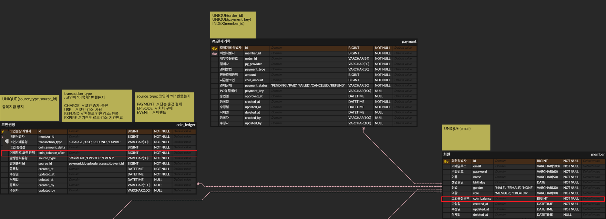

# 코인 결제 및 충전

## ✅ 요구사항

---

## ⚠️ 이슈사항
1. 중복: 결제 승인 / 웹훅 / 클라이언트 재시도 때문에 같은 결제가 2~N번 들어오는 경우가 발생 
2. 누락: 결제 승인은 성공했는데, 그 직후 서버 다운 / DB 롤백 / 네트워크 끊김 / 웹훅 지연 or 실패 -> 서버내 status 값 및 다른 결제 정보 누락
3. 트랜잭션 경계: 토스 API가 응답하는 동안 DB 커넥션이 묶여있으면 트래픽이 몰릴 때 토스 응답이 2~3초만 느려져도 다른 요청들이 전부 대기
4. 금액 검증: 클라이언트가 보낸 amount(결제금액)를 그대로 믿으면 조작에 취약
5. 잔고의 정합성: 회원의 코인잔액은 반드시 정합성을 유지해야 함

---

## 🛠️ 해결 방법
### 1. 중복 
- 유니크 제약조건 설정
  - payment 
    - UNIQUE(order_id): 중복된 주문이 생성될 수 없음
    - UNIQUE(payment_key): 중복된 결제가 생성될 수 없음
  - coinLedger 
    - UNIQUE(source_type, source_id): 중복된 원장 기록 생성될 수 없음 
- 멱등성 보장

### 2. 누락
- 전제: 결제 실패시 'FAILED' 상태 저장, Toss status가 'DONE'이 아니라면 해당 요청에 맞는 status 값 저장
<br/>

| Toss status         | 의미          | Creatorhub PaymentStatus |
| ------------------- | ----------- |--------------------------|
| READY               | 결제 생성       | PENDING                  |
| IN_PROGRESS         | 인증 완료, 승인 전 | PENDING                  |
| WAITING_FOR_DEPOSIT | 가상계좌 입금 대기  | PENDING                  |
| DONE                | 결제 승인 완료    | **PAID**                 |
| ABORTED             | 승인 실패       | **FAILED**               |
| EXPIRED             | 승인 안 해서 만료  | **FAILED**               |
| CANCELED            | 전체 취소       | **CANCELED**             |
| PARTIAL_CANCELED    | 부분 취소       | **REFUND** (또는 별도 상태)    |

참고: https://docs.tosspayments.com/reference#paymentdetaildto-status


- **누락 해결방법 3가지**
  <br/>
  `첫번째`, 결제완료 후 status 가 'PAID'가 아니라면 Toss PG에 결제 상태 다시 요청 => 현재 구현된 방법
```
        // PAID가 아니라면 토스에 결제 내역 재확인 요청
        if(paidPayment.getStatus() != PaymentStatus.PAID) {
            TossPaymentResponse tossPaymentResponse =
                    paymentConfirmService.callTossGetPayment(toss.paymentKey());

            paidPayment = applyPaid(
                    payment,
                    "TOSS",
                    toss.method(),
                    toss.paymentKey(),
                    toss.status(),
                    OffsetDateTime.parse(toss.approvedAt()).toLocalDateTime()
            );

        }
```
<br/>

`두번째` Toss 에서 제공하는 웹훅 사용 https://docs.tosspayments.com/guides/v2/webhook
<br/>
`세번째`, 이후 batch로 'PAID' 상태가 아닌 것은 재확인


### 3. 트랜잭션 경계
confirmAndSave()에 @Transactional 처리 하지 않음
<br/>
- callTossConfirm() 따로 호출
- findAndValidateAmountOrCreate(), afterConfirmSave() 별도로 트랜잭션 처리
```
  public PaymentResponse confirmAndSave(PaymentRequest req, Long id) {
  
        ...
        
        // 1. 결제 요청시 payment 테이블에 결과 반영
        Payment payment = paymentService.findAndValidateAmountOrCreate(member, req, coinAmount);
        
        ...
        
        try {
            // 2. 토스에 결제 요청
            TossConfirmResponse toss = callTossConfirm(req);

            // 3. 토스 결제 성공 후 payment, coin_ledger 테이블에 결과 반영
            return paymentService.afterConfirmSave(toss, member, payment);

        } catch (Exception e) {
            ...
        }
    }
```

### 4. 금액 검증
결제시작 시점(주문시) amount(결제금액)를 미리 DB에 저장한 후, PG Confirm 직전에 클라이언트가 보낸 amount와 db에 저장된 amount가 같은지 확인
```
    @Transactional
    public Payment findAndValidateAmountOrCreate(Member member, PaymentRequest req, long coinAmount) {
        return paymentRepository.findByOrderId(req.orderId())
                .map(payment -> {
                    if (!payment.getAmount().equals(req.amount())) {
                        log.warn("금액 불일치 감지 orderId={}, 서버기대금액={}, 클라이언트요청금액={}",
                                req.orderId(), payment.getAmount(), req.amount());
                        throw new PaymentAmountMismatchException();
                    }
                    return payment;
                })
                .orElseGet(() -> saveNewPending(member, req, coinAmount));
    }
```


### 5. 잔고의 정합성
member 테이블의 coin_balance(코인잔액)과 coin_leger 테이블의 coin_balance_after(거래직후 코인잔액)은 결제시 잔고의 정합성 유지가 중요.
<br>
coin_balance_after은 는 원장 기록에 포함되는 참고용으로, 조회 편의를 위한 값이며 불일치 가능성을 감수.
<br>
하지만 coin_balance는 회원의 코인잔액 이므로 반드시 정합성 고려 필요



JPA를 사용해 '조회->증가->저장' 패턴이 아닌 아래와 같이 원자적으로 업데이트
<br/>
('조회->증가->저장' 방법 사용시 레이스 컨디션에서 lost update 발생 가능성 존재)

```
    @Modifying(clearAutomatically = true)
    @Query("""
        UPDATE Member m
        SET m.coinBalance = m.coinBalance + :coinAmount
        WHERE m.id = :memberId
    """)
    void increaseCoinBalance(@Param("memberId") Long memberId,
                            @Param("coinAmount") long coinAmount);
```

---

